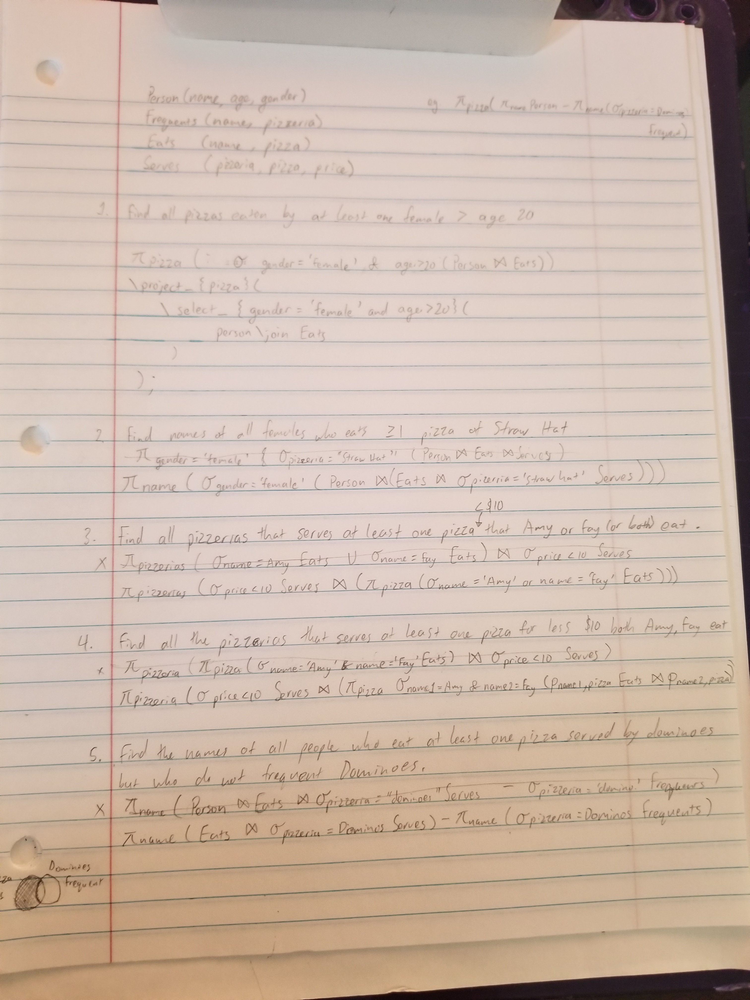

- In this assignment you are to write relational algebra queries over a small database, executed using our RA Workbench. Behind the scenes, the RA workbench translates relational algebra expressions into SQL queries over the database stored in SQLite. Since relational algebra symbols aren't readily available on most keyboards, RA uses a special syntax described in our RA Relational Algebra Syntax guide. 
- We've created a small sample database to use for this assignment. It contains four relations:

```SQL
    Person(name, age, gender)       // name is a key
    Frequents(name, pizzeria)       // [name,pizzeria] is a key
    Eats(name, pizza)               // [name,pizza] is a key
    Serves(pizzeria, pizza, price)  // [pizzeria,pizza] is a key
```
- use https://lagunita.stanford.edu/c4x/Engineering/db/asset/ra.html for RA syntax guide
- I've included the ra-pizza-database within the script files folder

___

- [Q1] Find all pizzas eaten by at least one female over the age of 20. 

```SQL
\project_{pizza}(
    \select_{gender='female' and age>20}(
        Person \join Eats
    )
);
```

___

- [Q2] Find the names of all females who eat at least one pizza served by Straw Hat. (Note: The pizza need not be eaten at Straw Hat.) 

```SQL
\project_{name}(
    \select_{gender='female'}(
        Person \join (
            Eats \join (
                \select_{pizzeria='Straw Hat'} Serves
            )
        )
    )
)
```

___

- [Q3] Find all pizzerias that serve at least one pizza for less than $10 that either Amy or Fay (or both) eat. 

```SQL
\project_{pizzeria}(
    \select_{price<10} (
        Serves \join (
            \project_{pizza}(
                \select_{name='Amy' or name='Fay'} Eats
            )
        )
    )
)
```


___

- [Q4] Find all pizzerias that serve at least one pizza for less than $10 that both Amy and Fay eat. 

```SQL
\project_{pizzeria}(
    \select_{price<10} (
        Serves \join (
            \project_{pizza}(
                \select_{name1='Amy' and name2='Fay'} (
                    \rename_{name1, pizza} Eats
                    \join
                    \rename_{name2, pizza} Eats
                )
            )
        )
    )
)
```


___

- [Q5] Find the names of all people who eat at least one pizza served by Dominos but who do not frequent Dominos. 

```SQL
\project_{name}(
    Eats \join(
        \select_{pizzeria='Dominos'} Serves
    )
)
\diff 
\project_{name}(
    \select_{pizzeria='Dominos'} Frequents
)

```

___

Here's my futile attempts at putting into word form first before putting into this ra form

