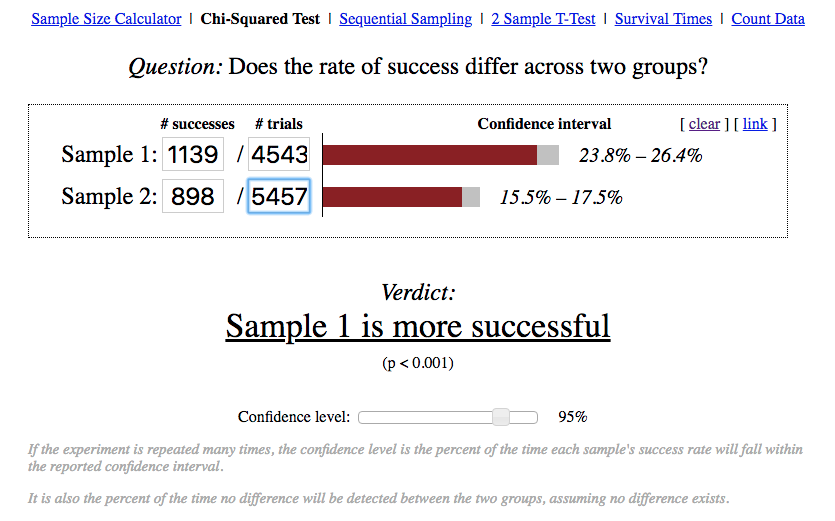
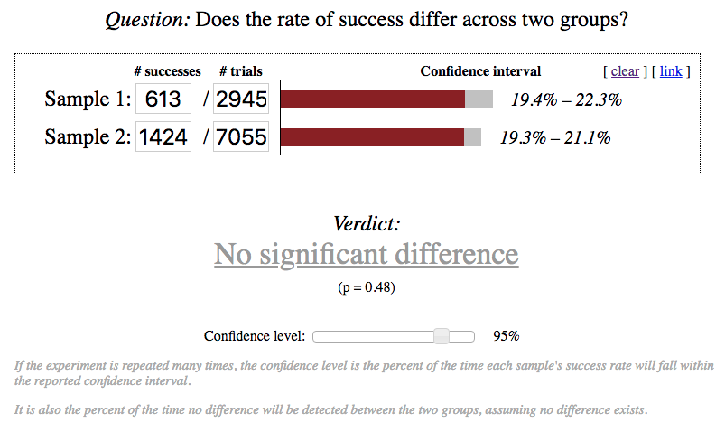
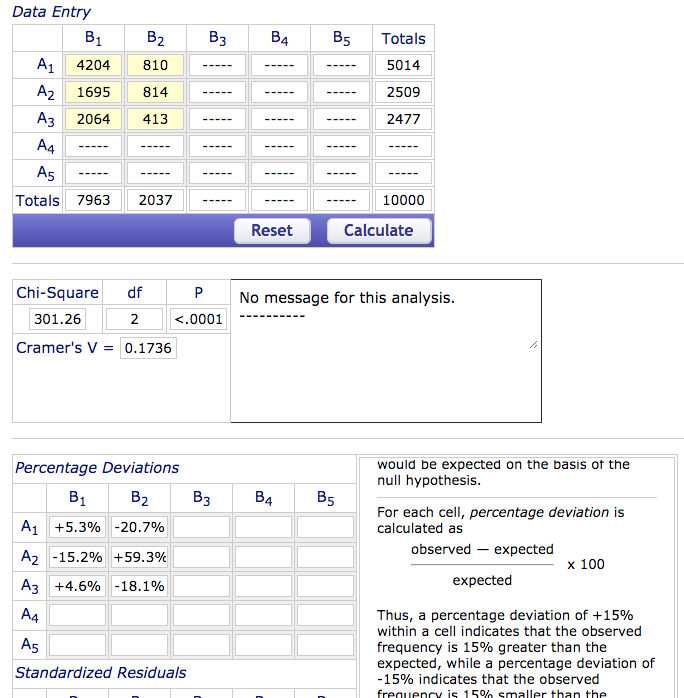
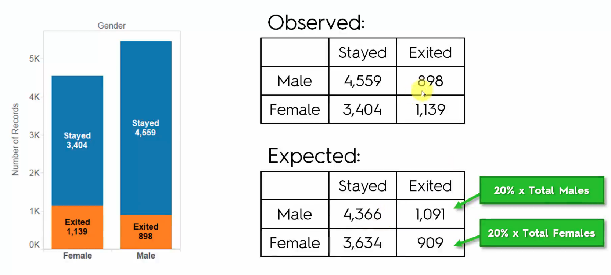
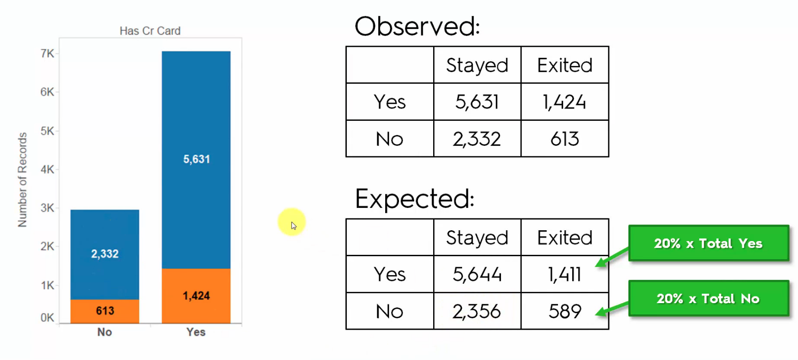

**Note:** my notes will be less detailed for now to see if my pace is faster
# Advanced Tableau
- Age in col, Number of records in row 
    - problem, single dot ~390kyears, 10k records
    - fix age from sum to dimension
        - note: age doesn't have decimal point so lost some data
        - we create a bin 5 for age(measure) and it creates an age dimension
            - get rid of our age col and replace with age(bin)
            - we get nice bar chart instead of jagged line plot
            - can edit bins easily, just go age(bin) and edit
    - remember you press CMD and drag into color and label within Marks section
- Now we make a duplicate from isActiveMember and drag Age(bin) over and replace in col
    - drag off text for Exited and we now have nice %
- If we want two charts on same page
    - let's drag Number of Records into rows next to previous one
    - we have a couple new tabs in Marks and can edit all, or separate charts
    - in our case we try make similar to age distribution
- Chi Squared test will tell us if a result is a statistical significant result
    - we'll use this website: http://www.evanmiller.org/ab-testing/chi-squared.html
        - note can't use percentages, need use actual values
    - quick change with reference line
        - y axis add reference line
            - scope: per cell, value: sum, label: value
    - Here's the sample when have only 2 categories (Genders)
        - 
        - when validate that chart is good, we can can change color indicate its good in the tabs
        - 
            - shows that our verdict that there's no differences (has credit card)
    - Let's try doing with more than 2
        - We use this website: http://vassarstats.net/newcs.html
        - let's work with geography
            - you can view chart as a table by going
                - show me: table -> transpose
            - 
                - the small p value show statistical significence (for countries)
                    - when go overall population can see overall effect of those living in germany
            - shortcut is since france and spain are similar we just compare germany with one of the others
                - still should show similar results
            - using shortcut, you can apply to age and just do for ages at 50 and 35 to show that age is important
- We will now duplicate Age analysis and for Balance we create a bin size 10000 (right click -> create)
    - so we drag balance bin and replace with the age one and we notice something different
        - we see 3618 0-9999 bin balances, this is quite normal, just means they could have other accounts, forgot to close, etc..
        - for our case, we should exclude it, we can right click exclude it
    - let's try doing a 10k bin for estimated salary
        - this case it's actually completely wrong 
            - not giving any value, just putting people uniformly across all bands

## Chi-Squared
1. Let's look at gender example again
    - 
    - if we add up exited it's around 2000, and total customers is ~10k, so that's 20% that left
    - Expected table, if there was no dependency
        - we grabbed 20% total males, and 20% total females for new values
    - so the CST will compare the observed and expected and tell you if there was a statistical significant difference or a random significence
2. What is a chi-squared test?
    - a test designed to test the probability of independence
        - test to see the variable (yes or no) we are looking if it is independent of gender
3. Example 2
    - 
    - if we ran visual test of has cr card and % of total num of records, should show no significant differences so we wouldn't need to run additional tests
4. Run Chi-Squared Tests in Excel
    - Already included an excel example using chi squared test
5. Verify CST using online tools
    - Look at notes aboves for those
6. Chi-squared Rules
    1. Probability of independence 
        - whether there is a corr between outcomes and a certain category
        - if p value < 5% says there is a correlation
    2. NOT the relationship between variables
        - all it can say is yes or no
    3. Cannot use %, need absolute values
    4. Categories must be Mutually Exclusive
    5. Never exclude one of the outcomes
