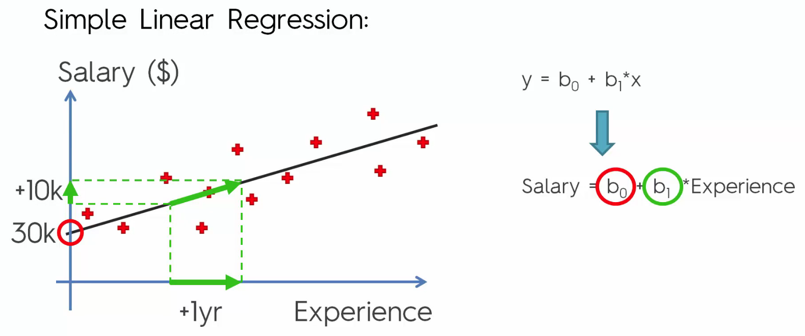
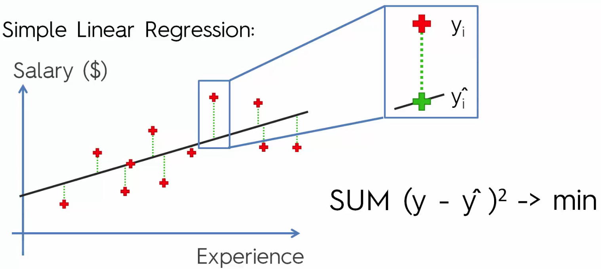
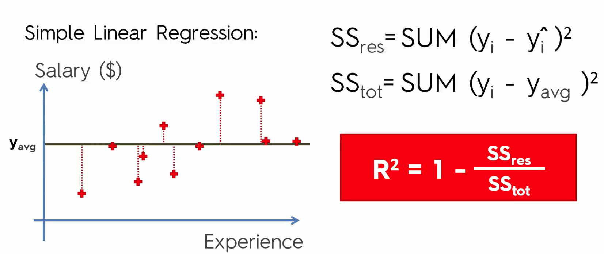
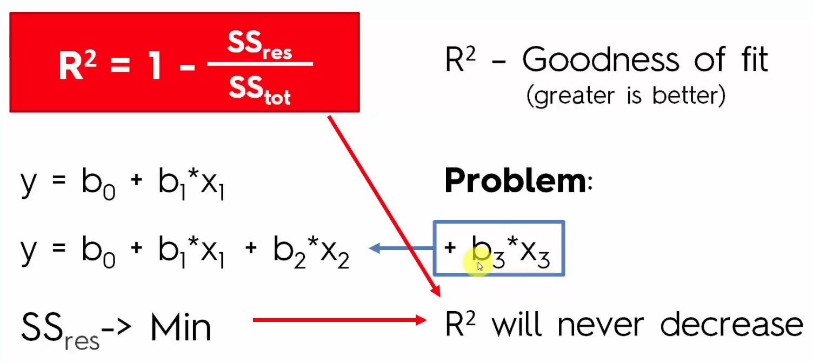
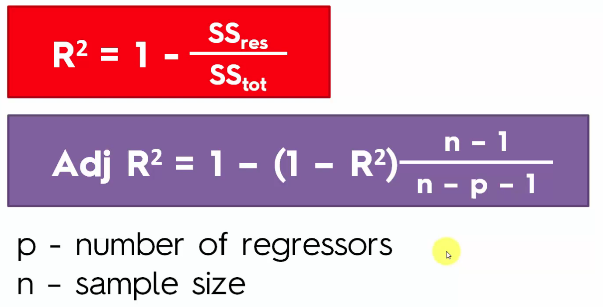

# Regressions
- Statistical process for estimating relatonships among variables
- focus on relationship between a dependent variable and one or more independent var

## Linear
- **Simple Linear Regression**
    - the formula of: y = b₀ + b₁ * x₁
        - y is the Dependent Variable (DV): something you are trying to explain
            - e.g. What grade  a student get depending on time spent on studying
        - x is the Independent variable (IV)
            - can be implied association for a change in the DV
        - b₁ is the Coefficient
            - the connector between y and x₁
        - b₀ is the constant
            - basically the point where the line crosses the y-axis
    - It's basically putting a best fit line through the chart that represents the data
        - 
            - here b₀ is where the line hits the y-axis
            - b1 defines our slope      
    - **Ordinary Least Squares**
        - 
        - Here the green cross is the model observation
        - red cross is what he actually earned
        - green dashed is the difference between the observed and the model
        - to make the best fitting line, we use the formula to get the SUM of the square of the green lines and grab the minimum
        - if you remove the -> min, it has a name: Sum of Squares residuals (SSres)
    - **R Squared**
        - It is a statistical measure of how close the data are to the fitted regression line
            - aka. coefficient of determination
            - R-Squared = Explained variation/ Total variation and always between 0-1 (0-100%)
        - Example shown below
        - 
            - R² = 1 - Sum of Squares residual/ total sum of squares
    - **Adjusted R²**
        - 
            - Problem.. if we were to have more variables added in
        - 
        - Adjusted R Squared penalizes you for adding in independent variables that doesn't help the model
        - The adjusted R-Squared is adjusted for the number of predictors in the model
            - increases only if the new term improves the model more than would be expected by chance

- **Multiple Linear Regression**
    - y = b₀ + b₁ * x₁ + b₂ * x₂ + ... bn * xn
    - This time we can have a lot of causations, so more IVs

## Logistic (This will be discussed later)
- Simple Logistic Regression
- Multiple Logistic Regression
